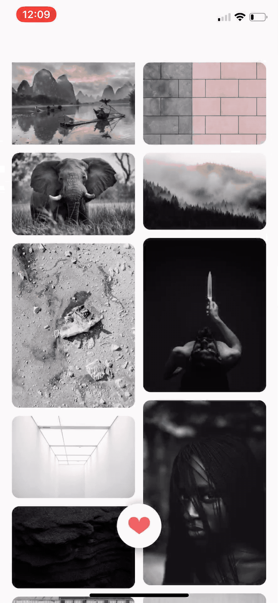

# WraithKing
## Demo GIF
|||
|--|--|
|||

## Requirement
- Xcode 10
- Swift 4.2
- Cocoapods 1.52+

## How to run
* Git clone this project or download it.
```SHELL
git clone https://github.com/lmcmz/WraithKing.git
```
* Install pod
```SHELL
cd WraithKing/WraithKing
pod install
```
* Open Xcode workspace project
```SHELL
open -a Xcode WraithKing.xcworkspace
```
